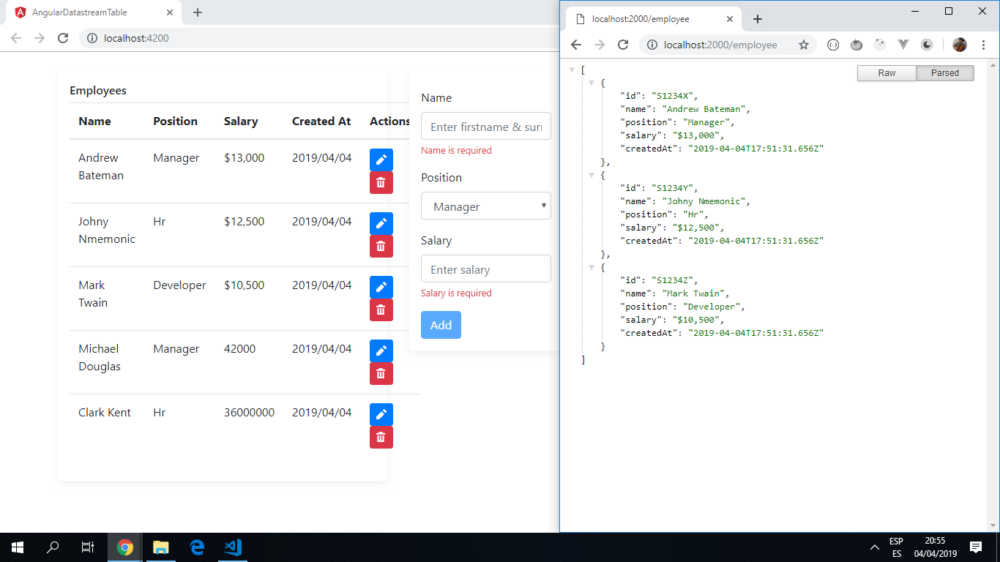

# :zap: Angular Datastream Table

* App with realtime communication between app and server using a websocket-based [Pusher](https://pusher.com/) channel for notifications/updates etc.

*** Note: to open web links in a new window use: _ctrl+click on link_**

## :page_facing_up: Table of contents

* [:zap: Angular Datastream Table](#zap-angular-datastream-table)
  * [:page_facing_up: Table of contents](#page_facing_up-table-of-contents)
  * [:books: General info](#books-general-info)
  * [:camera: Screenshots](#camera-screenshots)
  * [:signal_strength: Technologies](#signal_strength-technologies)
  * [:floppy_disk: Setup](#floppy_disk-setup)
  * [:computer: Code Examples](#computer-code-examples)
  * [:cool: Features](#cool-features)
  * [:clipboard: Status & To-Do List](#clipboard-status--to-do-list)
  * [:clap: Inspiration](#clap-inspiration)
  * [:file_folder: License](#file_folder-license)
  * [:envelope: Contact](#envelope-contact)

## :books: General info

* The pusher channel uses a publish/subscribe model so all subscribers to the channel will receive the update. See [Pusher documentation](https://pusher.com/docs) for more information.
* The server.js file follows the [Twelve-Factor](https://12factor.net/) methodology for building software-as-a-service apps that:

'_Use declarative formats for setup automation, to minimize time and cost for new developers joining the project;
Have a clean contract with the underlying operating system, offering maximum portability between execution environments;
Are suitable for deployment on modern cloud platforms, obviating the need for servers and systems administration;
Minimize divergence between development and production, enabling continuous deployment for maximum agility;
And can scale up without significant changes to tooling, architecture, or development practices._'

## :camera: Screenshots



## :signal_strength: Technologies

* [Angular v15](https://angular.io/)
* [rxjs v7](http://reactivex.io/) observable streams for asynschronous programming.
* [Pusher-js v8](https://pusher.com/) Real-time communication scalable features.
* [Bootstrap v5](https://getbootstrap.com/). Links added to `angular.json "styles"`
* [NgAlert v2](https://github.com/theo4u/ngAlert) alert component with different types of alert. Link added to `angular.json "styles"`.

## :floppy_disk: Setup

* Install dependencies using `npm i`
* Get your own API key and Cluster name from [Pusher-js](https://pusher.com/) Sandbox Plan
* Add Pusher API Key etc. to .env file
* Add API_KEY & CLUSTER values to `environment.ts` & `environment.prod.ts`
* Run `ng serve` for a dev server. Navigate to `http://localhost:4200/`
* Open a second command terminal
* Install nodemon globally if you don't have it already
* Run `nodemon server.js` to run the server backend. Navigate to `http://localhost:2000/`. Restarts with changes
* Run `ng build` to build the project. The build artifacts will be stored in the `dist/` directory. Use the `--prod` flag for a production build.

## :computer: Code Examples

* Function to delete an employee record with alert message before using the '_actualDelete' function.

```typescript
  delete(employee: IEmployee) {
    // show delete confirmation with ngAlert
    this._ngAlert.push({
      message: `<strong>Are you sure!</strong> you want to delete this employee with name <strong>${employee.name}</strong>`,
      type: MessageType.warning,
      buttons: [
        {
          label: 'Continue',
          action: () => {
            this._actualDelete(employee);
          },
          css: 'btn btn-danger'
        }
      ]
    });
  }

```

## :cool: Features

* Forms created using [Angular's reactive forms](https://angular.io/api/forms/ReactiveFormsModule).
* Utility/helper classes used from [Bootstrap v5](https://getbootstrap.com/).
* real-time data and functionality using [Pusher event-based API 'Pusher Channel'](https://pusher.com/).
* working local server backend.
* Data access services delegated to separate service components.

## :clipboard: Status & To-Do List

* Status: Working front and backend. UI adds employees to the list. Employees can be added & deleted successfully but the edit component is not coded so not possible to edit employee records.
* To-Do: Look at employee edit function. Customise app and add functionality. Consider currency pull-down menu for salary input.

## :clap: Inspiration

* [Christian Nwamba's tutorial: BUILD A REALTIME TABLE WITH ANGULAR](https://pusher.com/tutorials/realtime-table-angular),

## :file_folder: License

* This project is licensed under the terms of the MIT license.

## :envelope: Contact

* Repo created by [ABateman](https://github.com/AndrewJBateman), email: gomezbateman@yahoo.com
